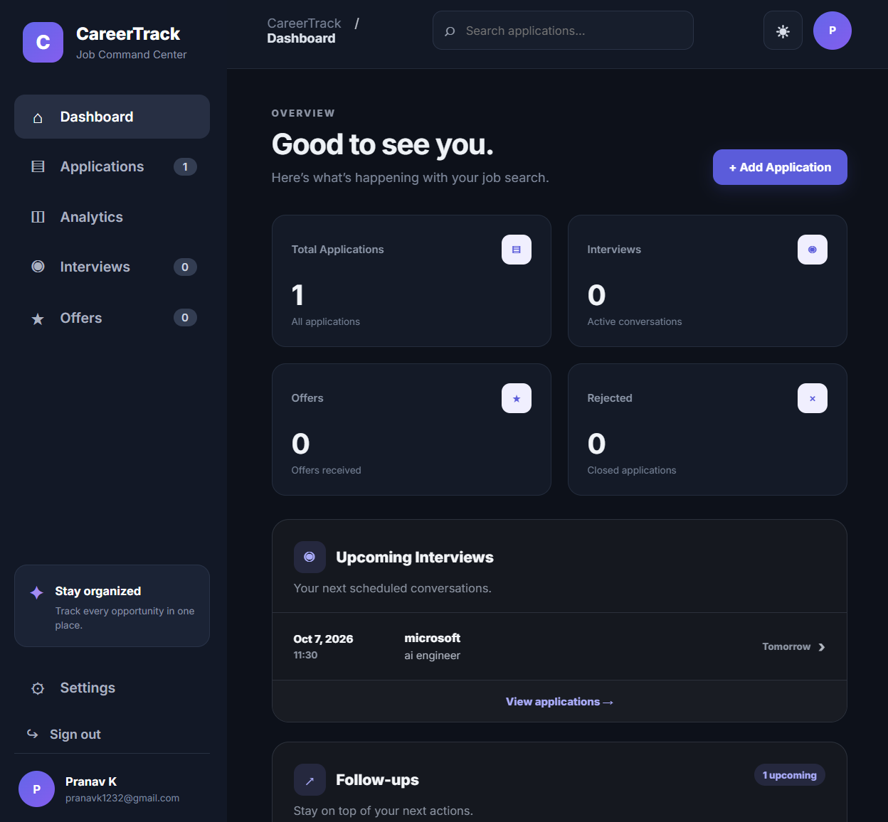
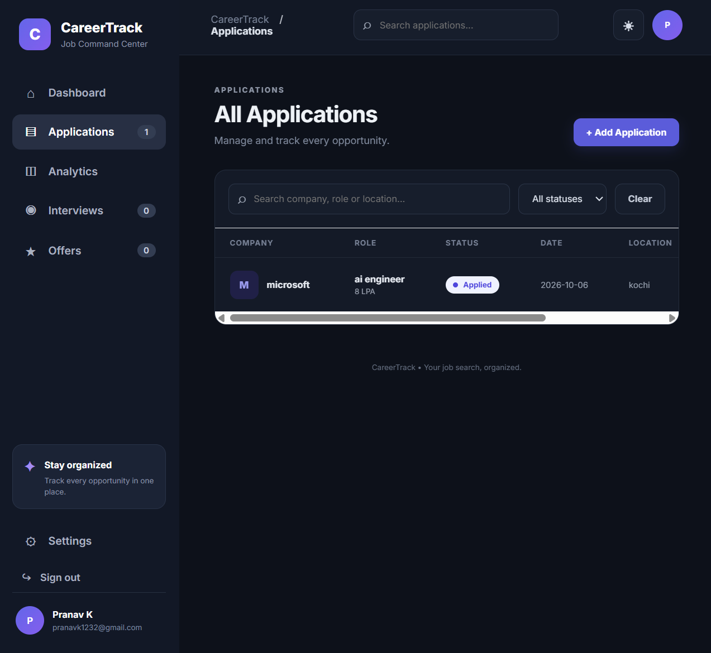
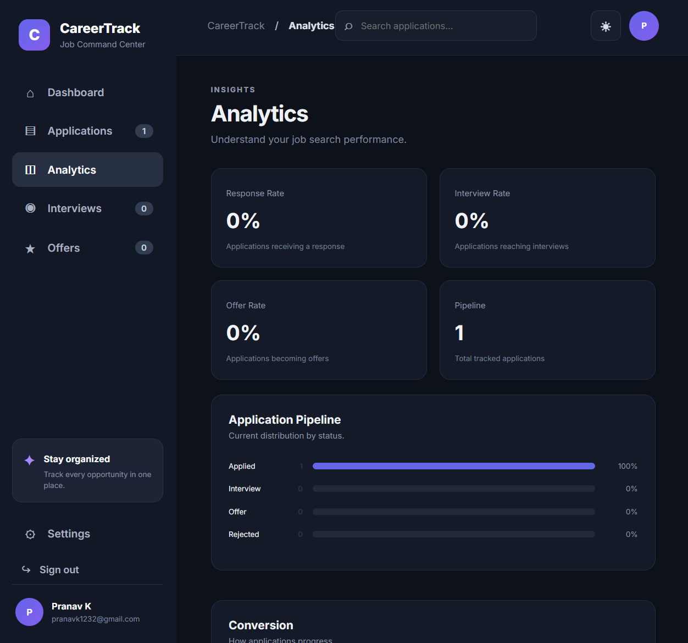

# CareerTrack

A full-stack job application tracker for managing applications, interviews, follow-ups, and career progress. Built with React, Node.js, Express, and MongoDB.

## 🚀 Live Demo

**Live application:** https://career-track.vercel.app/

**GitHub:** https://github.com/pranavk3212/CareerTrack

## ✨ Features

### Authentication
- User registration and login
- JWT-based authentication with bcrypt password hashing
- Each user can only access their own data

### Application Management
- Add, edit, and delete job applications
- Track application status
- Search and filter applications
- CSV export

### Interview Management
- Schedule interviews
- Store interviewer details
- Save meeting links and interview notes

### Follow-up Tracking
- Follow-up dates
- Next actions
- Upcoming reminders

### Dashboard & Analytics
- Application statistics and pipeline overview
- Recent activity and interview tracking
- Status breakdown, progress tracking, and conversion insights

### User Experience
- Responsive interface
- Dark mode
- Clean job-tracking workflow

## 🛠 Tech Stack

| Layer | Technologies |
| --- | --- |
| Frontend | React, Vite, JavaScript, CSS |
| Backend | Node.js, Express.js |
| Database | MongoDB, Mongoose |
| Authentication | JWT, bcrypt |
| Deployment | Vercel |
| Version Control | Git, GitHub |

## 🏗 Architecture

```text
React + Vite
     │
     │ REST API
     ▼
Express.js Backend
     │
     │ Mongoose
     ▼
MongoDB Atlas
```

## 📁 Project Structure

```text
CareerTrack/
├── client/        # React + Vite frontend
├── server/        # Express REST API
├── docs/          # Project documentation and screenshots
└── package.json   # Root scripts
```

## 💻 Getting Started

### Prerequisites

- Node.js 18 or later
- MongoDB database, local or MongoDB Atlas

### Clone and install

```bash
git clone https://github.com/pranavk3212/CareerTrack.git
cd CareerTrack
npm install
npm install --prefix server
npm install --prefix client
```

### Environment variables

Create `server/.env`:

```env
PORT=5000
MONGO_URI=mongodb://localhost:27017/careertrack
JWT_SECRET=replace-with-a-long-random-string
```

Never commit real secrets or production credentials.

### Run locally

```bash
npm run dev
```

Or separately:

```bash
npm run server
npm run client
```

The Vite frontend runs on port `5173` by default.

## 📸 Screenshots

### Login


### Dashboard



### Applications



### Analytics



## 📌 Project Status

CareerTrack is deployed as a working full-stack application. Future improvements may include automated API tests for authentication and application routes.

## 👤 Author

**Pranav K**

- GitHub: https://github.com/pranavk3212
- LinkedIn: https://linkedin.com/in/pranav-k-2454451ba
- Portfolio: https://pranavk3212.github.io/Pranav-k-portfolio/
